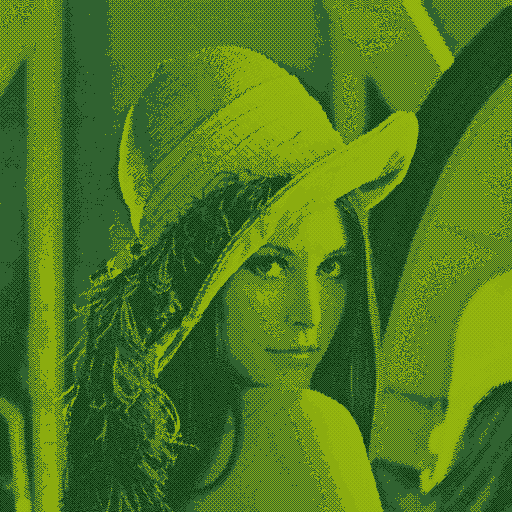

# Gameboy-Image-Filter

## How to Build
`cargo build --release`

## How to use
`./gb_filter <input-file> <output-file>` \
To change dithering level: \
`./gb_filter --dithering=[none, low, mid, high] <input-file> <output-file>`
